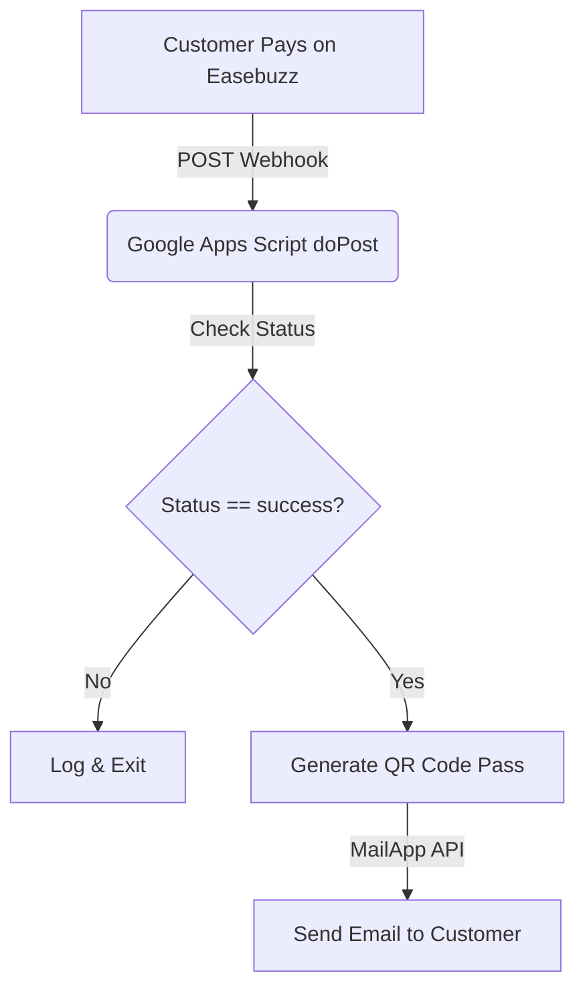

# Bloomingreen Event Landing Page & Webhook System

A lightweight, high-performance static landing page and notification backend for the **One Night to Bloom** event series, currently configured for **Grouch** at **The Humming Tree, Bangalore**.

---

## 📂 Repository Structure

```bash
├── CNAME                         # Custom Domain mapping (currently: grouch.bloomingreenfestival.com)
├── index.html                    # Main landing page (event details, ticket selection, T&C)
├── thank-you.html                # Booking success page (parses URL params for personalized confirmation)
├── index.css                     # Base CSS design tokens
├── design3.css                   # Active visual layout (glassmorphism, morph animations, responsive styles)
├── google_script_email.js        # Google Apps Script webhook listener & QR email engine
├── GrouchF.avif                  # Main event artist image (Active)
├── Symbolico_a.avif              # Previous event artist image (Archived)
└── README.md                     # This file (system documentation)
```

---

## 🎨 Visual Design & Layout (`design3.css`)

The site uses a premium **glassmorphism** aesthetic suited for music and flow arts events:
- **Radial Gradients**: Deep slate/purple backgrounds (`#0f172a` transitioning to `#8b5cf6` and `#f59e0b`).
- **Artist Morphing Blob**: A fluid, changing SVG-like border-radius animation around the main artist image.
- **Flowing Title Gradients**: Text-clipped color animations in the header title text.
- **Translucent Cards**: Frosted-glass containers (`backdrop-filter: blur(20px)`) housing event descriptions and ticket pricing.
- **Responsive Layout**: Dedicated media queries optimizing text sizing, margins, and card columns for mobile viewports.

---

## 🛠️ Integrations & Analytics

Both `index.html` and `thank-you.html` include pre-configured tracking scripts in their `<head>`:
- **Google Tag Manager (GTM)**: Container ID `GTM-MFDJ22CJ`.
- **Google Analytics 4 (GA4)**: Tag ID `G-NKW7EP680V`.
- **Facebook Pixel**: ID `2186770388231189`. 
  - Triggers a `PageView` event on the landing page.
  - Triggers a `Purchase` event (valued at ₹1200.00 INR) on `thank-you.html`.

---

## ⚙️ Webhook & Email System (`google_script_email.js`)

Because the site is hosted statically (GitHub Pages), ticket booking notification handling is offloaded to a **Google Apps Script** serverless deployment.



### 1. Webhook Flow
1. Customer clicks the **Easebuzz payment link** (`https://easebuzz.in/link/one-night-to-bloom-with-grouch`) and completes checkout.
2. Easebuzz payment gateway sends an HTTP POST transaction webhook to the Google Apps Script deployment URL.
3. The `doPost(e)` function parses the incoming payload (supporting both JSON and `application/x-www-form-urlencoded` formats).
4. If transaction status is `success`, `sendConfirmationEmail()` is triggered.

### 2. Email Formatting & QR Generation
- Generates a ticket QR code dynamically using the `goqr.me` API:
  `https://api.qrserver.com/v1/create-qr-code/?size=150x150&data=<customer-email>`
- Sends a styled responsive HTML email containing the QR pass, payment amount, Transaction ID, event timing, and venue location.

### 3. Manual Resend Utility
`google_script_email.js` includes a helper function `sendEmailsToPastBookings()`. If any ticket buyers complete their transaction before the active script is updated, their details can be listed in this array and batch-emailed by running this function manually in the Google Apps Script IDE.

---

## 🚀 How to Transition to a New Event (For Future Developers/AI)

When a new event is announced, follow these steps to update the codebase:

### 1. Asset & Content Updates
- Place the new artist portrait (preferably `.avif` or `.webp`) in the root directory.
- In `index.html`:
  - Update `<title>`, description meta tags, keywords, and Open Graph tags.
  - Update the `` src in the `.artist-blob` element to the new image file name.
  - Update `<h1 class="event-title">` to reference the new artist.
  - Update `<p class="context-info">` with the new venue and date/timings.
  - Update the ticket CTA button links `href="..."` to point to the new Easebuzz payment links.
  - Update pricing values and names under the ticket tier container (`.price-box`).
- In `thank-you.html`:
  - Update the SEO metadata and main text confirmation dates.

### 2. Apps Script Backend Updates
- In `google_script_email.js`:
  - Update default script values (e.g. `productinfo` string).
  - Update template text in `sendConfirmationEmail()` (Subject line, Event name, Date, and Venue).
  - Update the `pastBookings` list in case manual resends are needed.
- Open the script editor at [script.google.com](https://script.google.com/), paste the updated code, save, and **deploy a new version** using **Deploy > Manage deployments > Edit > New Version**.
